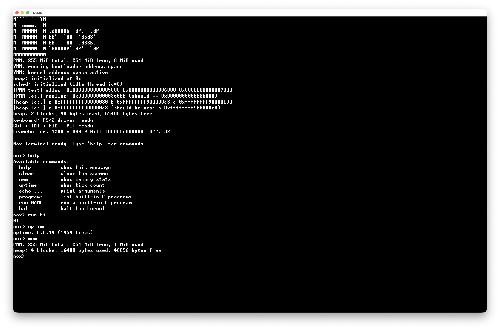

# Nox Kernel 🌌

A hobbyist x86_64 "bare-metal" operating system kernel built from **scratch** using the **Limine Boot Protocol**. Nox features a custom graphics rendering engine, standalone serial debugging facilities, synchronous keyboard driver logic, and cooperative thread scheduling.



---

## 🚀 Features

* **Bootloader:** Powered by the Limine Boot Protocol (Revision 3) supporting standard x86_64 architectural setups.
* **Graphics Framebuffer:** Hand-rolled canvas architecture featuring a customized **8x16 VGA bitmap font engine** with custom string parsing (`kprintf`).
* **Interactive Demos:** Includes a continuous breathing and bouncing DVD-style rainbow square that dynamically modulates size and canvas color channels.
* **Drivers:** * **Serial Terminal (COM1):** Automated terminal control sequences (ANSI `\033` escape codes) featuring cross-interface echoing.
    * **PS/2 Keyboard:** State-safe scan code translator utilizing bitmasks to eliminate modifier inversion bugs from autorepeat loops.
* **Scheduler:** Cooperative multi-threading framework utilizing a non-blocking IRQ execution wait-state pipeline (`sched_block` / `sched_unblock`).

---

## 🛠️ Project Structure

```text
├── arch/            # Low-level CPU architectural mechanics
├── build/           # Compiled object targets and final outputs
├── drivers/         # Hardware subsystem handlers (serial.c, keyboard.c)
├── include/         # Unified system definitions and Limine specification headers
├── kernel/          # Direct kernel lifecycle mainlines (kmain.c)
├── lib/             # Custom runtime functions (printf.c, display.c, font.h)
└── sched/           # Thread context management interfaces
```

## 💻 Building and Running

### Prerequisites

You need an environment with `clang, make, xorriso`, and `qemu-system-x86_64` installed.

If you are building on **macOS**, ensure you have the appropriate cross-compilation target setups available via the command-line tools interface.

### Download Limine

```bash
git clone https://github.com/limine-bootloader/limine.git --branch=v8.x-binary --depth=1
make -C limine
```

### Compilation

To compile the entire codebase, generate the build artifacts, and construct the bootable ISO:

```bash
make
```

Running in QEMU

To boot your custom ISO directly inside QEMU with serial debugging piped right back into your host shell terminal emulator run:

```bash
make run
```

This runs the execution pipeline using the following command structures internally:

```bash
qemu-system-x86_64              \
    -cdrom build/nox.iso        \
    -m 256M                     \
    -serial stdio               \
    -vga std                    \
    -no-reboot                  \
    -no-shutdown
```

### Other

Don't use `Windows 8/10 Feature`
Don't use `CSM`
Use FASTBOOT with PS/2 Feature

## 📜 License

This project is licensed under the [MIT License](./LICENSE) see local source declarations for details.